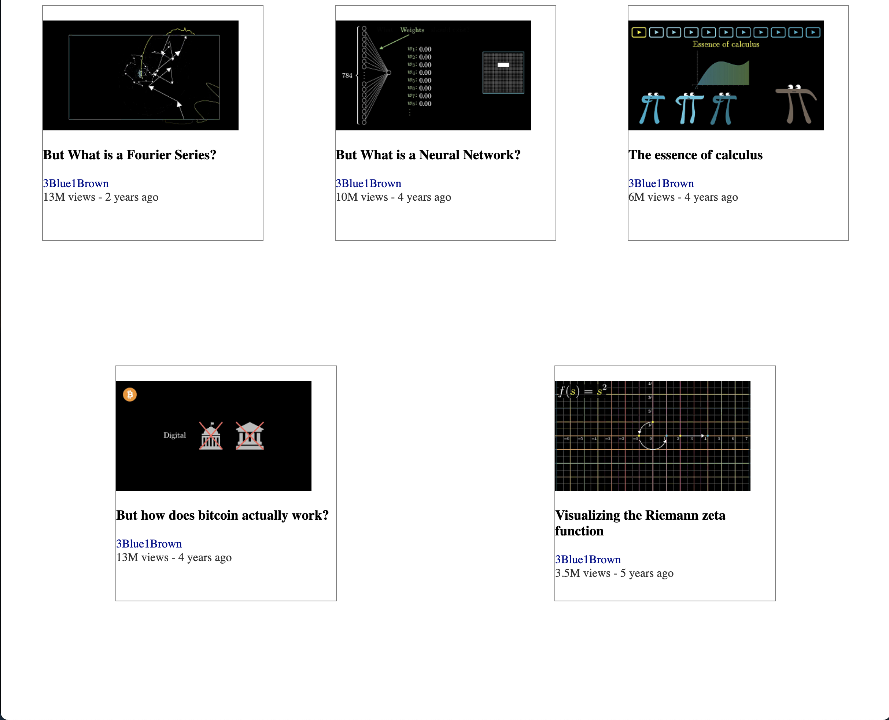
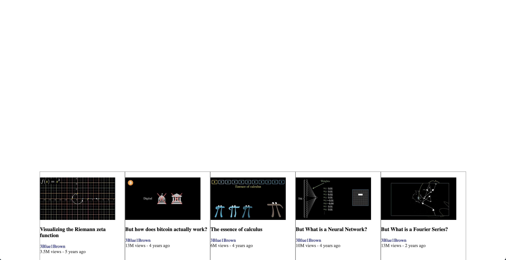
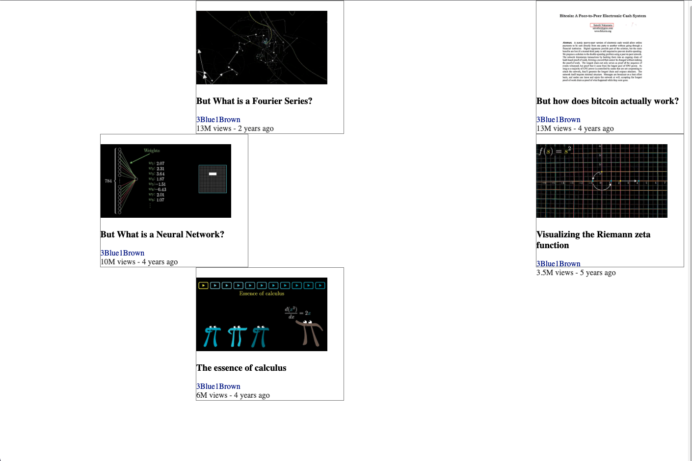

# Flex Box Activity

# 1

In `activity.html`, comment in the link for `1.style.css`.
Use flex box to make the video thumbnails look like:

# 2

In `activity.html`, comment in the link for `2.style.css`.
Use flex box to make the video thumbnails look like:

# 3

In `activity.html`, comment in the link for `3.style.css`.
Use flex box to make the video thumbnails look like:

